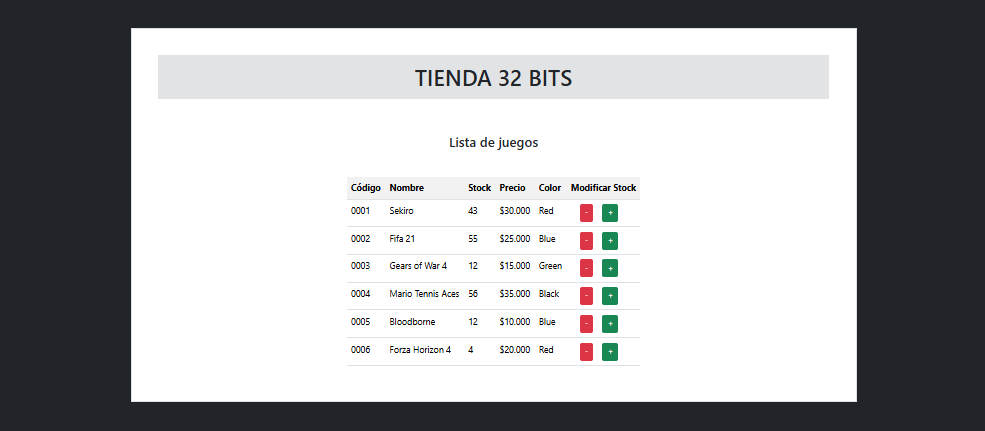

# **WEB APPLICATION TO MANAGE STORE INVENTORY**
Through this web interface, you can manage inventory quantities.

## **Technologies Used**
- **Vue.js**
- **Vue Router**
- **Vuex**
- **Vite**
- **Json**
- **JavaScript**
- **Bootstrap**
- **HTML5**
- **CSS3**

## **Features**
1. **State Management with Vuex**  
   - Centralized state management to handle all application data efficiently.

2. **JSON-Based Game Listing**  
   - Stores a JSON file containing video game data in the global state for easy access and management.

3. **Dynamic Rendering of Game Data**  
   - Uses `mapState` to display the list of games in the main component (`App.vue`), ensuring a reactive UI.

4. **Interactive Stock Management**  
   - Implements Vuex actions to dynamically modify the stock of video games.

5. **Single Page Application (SPA)**  
   - Built as an SPA using Vue.js and Vite for a seamless and responsive user experience.

6. **Scalable and Modular Design**  
   - Leverages Vuex for scalable state management, making the application modular and easy to extend.


## Customize configuration

See [Vite Configuration Reference](https://vite.dev/config/).

## Project Setup

```sh
npm install
```

### Compile and Hot-Reload for Development

```sh
npm run dev
```

### Compile and Minify for Production

```sh
npm run build
```
## **Screenshots**
<p align="center">
  
</p>
